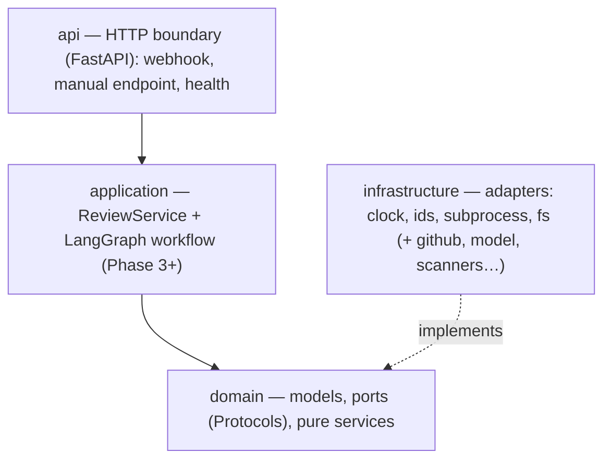
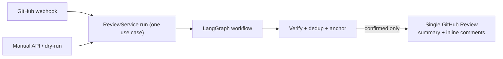

# Architecture

> Status: this document tracks the **real** structure and the **target** design, and marks which is
> which. Detailed per-topic guides and diagrams (the full LangGraph graph, webhook flow, etc.) are
> added as the corresponding code lands. Decisions are recorded as [ADRs](docs/adr/).

## Overview

Bicho analyzes a GitHub Pull Request and publishes a single review with inline comments. It is a
**single stateless container** with **no database**: GitHub itself is the source of truth for what has
already been reviewed. The same use case runs from two entrypoints — an automatic **webhook** and a
manual **API** call — so there is one code path, not two.

## Layers and the dependency rule



**`api → application → domain ← infrastructure`.** The domain imports nothing framework-specific.
`langgraph`/`langchain` appear only in `application`; `langchain_openai`, `httpx`, `semgrep`,
`pip-audit`, and `ast` appear only in `infrastructure`. Everything with a side effect (clock,
randomness, subprocess, filesystem, network) sits behind a **port** (a `Protocol` in
`domain/ports/`) with an injectable implementation — which is what makes the whole suite deterministic
and 100%-coverable offline.

## What exists today

The full offline pipeline is implemented and runs end to end on fakes/RESPX (no credentials, no
network); only the live deploy remains.

- `config` — `Settings` (pydantic-settings) with nested `GitHub` / `LLM` / `Scanner` sections,
  `Environment` (local/test/production), structlog config with a secret-scrubbing processor.
- `domain` — models (`PullRequest`, `NormalizedDiff`, `Finding`, `ReviewDraft`, `ReviewMarker`,
  `AnalyzerOutcome`), ports (`GitHubPort`, `ModelProvider`, `DiffParserPort`, `LanguageAdapter`,
  system seams), and pure services (fingerprint, dedup, diff-mapping, anchoring, verification).
- `application` — `ReviewService` (the one use case) and the LangGraph workflow: nodes, resilience
  wrapper, compose, plus six LLM analyzers behind a shared `LLMAnalyzer`.
- `infrastructure` — `GitHubClient` + App JWT auth (cached installation token), `LangChainModelProvider`
  (+ MiniMax registry), the in-house diff hunk parser, `SemgrepScanner` and `DependencyAuditScanner`,
  the language adapter/registry, and the system adapters (clock, ids, subprocess, temp workspace,
  pathsafe).
- `api` — the app factory + lifespan (owns the shared `httpx` client and builds the composition-root
  `Container`), `POST /reviews` (dry-run by default), `POST /webhooks/github`, the
  `BackgroundReviewRunner`, and `/healthz`.

## Review pipeline



The LangGraph workflow is a linear spine into a single parallel fan-out superstep, fanned back in via
`operator.add` reducers, then a gated linear finish:

```
fetch_pull_request → fetch_changed_files → normalize_diff → detect_language
  → gather_file_contents → select_analyzers
  ─fan-out→ { correctness · security · performance · maintainability · tests · contracts
              · semgrep · pip-audit }  → collect_findings   ←fan-in
  → verify_findings → compose_review
  → idempotency_guard ─cond→ stale_head_guard ─cond→ publish_github_review → END
```

Its load-bearing invariant: because a raised exception in a parallel superstep rolls the **whole**
superstep back, every scanner/analyzer node is wrapped so it **degrades to a diagnostic instead of
raising**. The manual and webhook paths run the *same* graph; only `ReviewOptions`
(`dry_run` / `force` / `focus` / `categories`) differ. See [AGENTS.md](AGENTS.md) and the ADRs.

## Key decisions

See [docs/adr/](docs/adr/). The load-bearing ones:
[no database, GitHub as source of truth](docs/adr/0003-no-database-github-as-source-of-truth.md) ·
[single container, in-process background tasks](docs/adr/0004-single-container-in-process-background-tasks.md) ·
[100% coverage + TDD](docs/adr/0005-one-hundred-percent-coverage-and-tdd.md) ·
[language-agnostic core](docs/adr/0006-language-agnostic-core-with-adapters.md) ·
[model-provider abstraction + function calling](docs/adr/0007-model-provider-abstraction-and-function-calling.md) ·
[one review: idempotency + stale-head guard](docs/adr/0008-one-review-idempotency-marker-and-stale-head-guard.md) ·
[deterministic scanners](docs/adr/0009-deterministic-scanners-semgrep-and-pip-audit.md).

## Limitations

Deliberate constraints (non-durable background tasks, single instance, no exactly-once) are documented
honestly in [docs/limitations.md](docs/limitations.md).
