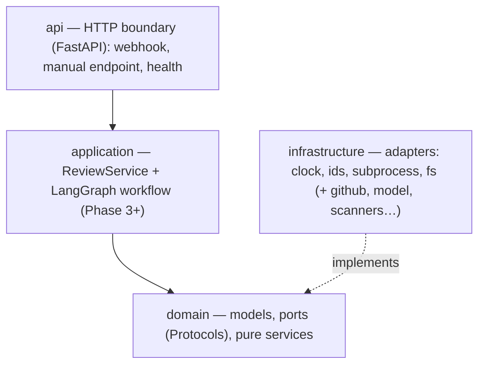
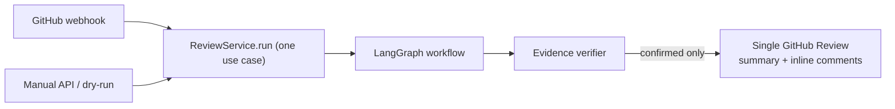

# Architecture

> Status: this document tracks the **real** structure and the **target** design, and marks which is
> which. Detailed per-topic guides and diagrams (the full LangGraph graph, webhook flow, etc.) are
> added as the corresponding code lands. Decisions are recorded as [ADRs](docs/adr/).

## Overview

Bicho analyzes a GitHub Pull Request and publishes a single review with inline comments. It is a
**single stateless container** with **no database**: GitHub itself is the source of truth for what has
already been reviewed. The same use case runs from two entrypoints — an automatic **webhook** and a
manual **API** call — so there is one code path, not two.

## Layers and the dependency rule

**`api → application → domain ← infrastructure`.** The domain imports nothing framework-specific.
`langgraph`/`langchain` appear only in `application`; `langchain_openai`, `httpx`, `semgrep`,
`pip-audit`, and `ast` appear only in `infrastructure`. Everything with a side effect (clock,
randomness, subprocess, filesystem, network) sits behind a **port** (a `Protocol` in
`domain/ports/`) with an injectable implementation — which is what makes the whole suite deterministic
and 100%-coverable offline.

## What exists today

- `config` — `Settings` (pydantic-settings), `Environment` (local/test/production), structlog config
  with a secret-scrubbing processor.
- `domain/ports/system.py` — `Clock`, `IdGenerator`, `SubprocessRunner`, `TempWorkspace`,
  `ProcessResult`; `domain/errors.py` — `BichoError`/`UnsafePathError`.
- `infrastructure` — `SystemClock`, `UuidGenerator`, `AsyncSubprocessRunner` (no shell,
  kill-on-timeout), `TempWorkspaceFactory` (guaranteed cleanup), and `fs/pathsafe.py`
  (traversal/absolute/symlink-escape rejection; binary/generated/vendored/size classification).
- `api` — the FastAPI app factory and a `/healthz` liveness endpoint.

## Target review pipeline (in progress)

The LangGraph workflow (Phase 3+) is a linear spine into a single parallel fan-out superstep
(deterministic scanners + specialized analyzers), fanned back in via reducers, then verified,
deduplicated, aggregated, and published behind stale-head and idempotency guards. Its load-bearing
invariant: because a raised exception in a parallel superstep rolls the whole superstep back, every
scanner/analyzer node is wrapped so it **degrades instead of raising**. See
[AGENTS.md](AGENTS.md#langgraph--langchain-rules-phase-3) and the ADRs.

## Key decisions

See [docs/adr/](docs/adr/). The load-bearing ones:
[start clean from the template](docs/adr/0002-start-clean-from-template.md) ·
[no database, GitHub as source of truth](docs/adr/0003-no-database-github-as-source-of-truth.md) ·
[single container, in-process background tasks](docs/adr/0004-single-container-in-process-background-tasks.md) ·
[100% coverage + TDD](docs/adr/0005-one-hundred-percent-coverage-and-tdd.md) ·
[language-agnostic core](docs/adr/0006-language-agnostic-core-with-adapters.md).

## Limitations

Deliberate constraints (non-durable background tasks, single instance, no exactly-once) are documented
honestly in [docs/limitations.md](docs/limitations.md).
