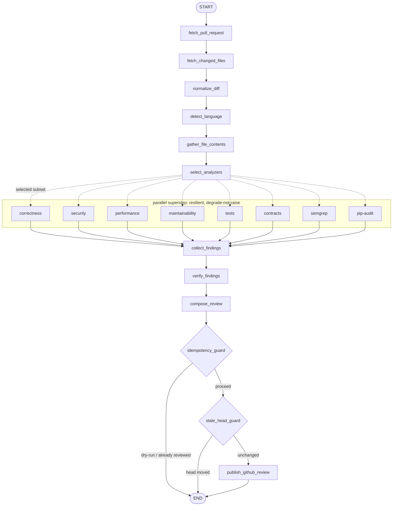
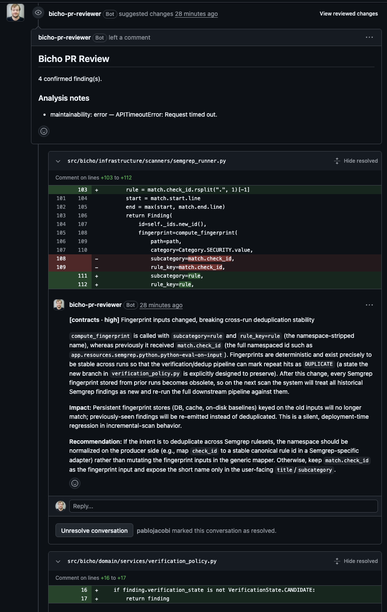

# Bicho PR Reviewer

[](https://github.com/pablojacobi/bicho-pr-reviewer/actions/workflows/ci.yml)
[](https://github.com/pablojacobi/bicho-pr-reviewer/actions/workflows/codeql.yml)
[](https://codecov.io/gh/pablojacobi/bicho-pr-reviewer)
[](https://www.python.org/downloads/)
[](LICENSE)

> Automated GitHub Pull Request review agent — it gathers PR context, runs deterministic scanners
> (Semgrep CE, pip-audit) plus LLM-based specialized analyzers, **verifies** findings to cut false
> positives, and publishes a **single** GitHub Review: an executive summary plus multiple **inline
> comments** anchored to the exact file/line/range. *(bicho — Spanish for "critter".)*

Two kinds of review in one pass: deterministic scanners catch the *known* (CVEs, injection
patterns), specialized LLM analyzers catch the *contextual* — and a verifier gate keeps either
from posting noise. A reviewer that confidently invents problems is worse than none.

Built in the open, phase by phase, with strict TDD and **100% line + branch coverage**. The full
review pipeline runs end to end **offline** (fakes + RESPX, no credentials, no network) — and it
runs live on Railway as a GitHub App.

## What it does

- Triggers automatically on a GitHub App **webhook** (PR opened / reopened / synchronize / ready for
  review) and runs the analysis as an in-process background task — or on demand via a **manual API
  endpoint** (`POST /reviews`) with `dry_run` to preview the review without posting.
- Routes the diff through a typed **LangGraph** workflow with fan-out/fan-in over deterministic
  scanners (**Semgrep CE**, **pip-audit**) and six specialized LLM analyzers (correctness, security,
  performance, maintainability, tests, contracts), then a **verifier** that reduces false positives.
- Publishes **one** GitHub Review with inline comments — each with category, severity, explanation,
  impact and a recommendation. Findings that can't be anchored to the diff go into the summary.
  Idempotency (a hidden marker) and a stale-head guard prevent duplicate or misplaced reviews.

## The pipeline

A linear spine fans out into one parallel superstep (six LLM analyzers + two deterministic
scanners), fans back in via `operator.add` reducers, then a gated publish tail. Every fan-out
node degrades to a diagnostic instead of raising, so one failure never rolls back the superstep.



## Live demo

Bicho runs live on Railway. Opening a pull request triggers an automatic review published by the
`bicho-pr-reviewer[bot]` account. A real inline comment it posted, verbatim, on a PR that added a
helper wrapping `subprocess.run(user_input, shell=True)`:

> **[security · critical]** Command injection via subprocess with shell=True on user input
>
> The new `run_command` function passes `user_input` directly to `subprocess.run(..., shell=True)`.
> When `shell=True` and the argument is a string, the value is interpreted by `/bin/sh -c`, so any
> user-controlled string is executed as shell. An attacker can inject arbitrary commands via
> metacharacters such as `;`, `&&`, `|`, backticks, or `$(...)`, leading to full RCE under the
> process's privileges.
>
> **Impact:** Remote/local arbitrary command execution (RCE) …
>
> **Recommendation:** Do not use `shell=True` with user-controlled input. Pass a list of arguments …

The same PR's review also flagged an `eval()` on user input, a missing timeout, absent test coverage,
and (via pip-audit) known CVEs in a pinned dependency — one review, many anchored inline comments.

### Bicho reviewing its own pull requests

The App is installed on this very repository, so Bicho reviews its own PRs. On a refactor of the
Semgrep finding id, it flagged — unprompted — that changing the fingerprint inputs would break
cross-run deduplication, calling it a *"silent, deployment-time regression in incremental-scan
behavior."* That is a correct, senior-level observation about the change under review:



See the [architecture diagrams](docs/diagrams.md) for the LangGraph workflow, the model-provider
abstraction, the webhook flow, and LangSmith tracing.

## Design highlights

- **Single container, no database.** GitHub is the source of truth; idempotency via a hidden review
  marker keyed on the head SHA. Deliberately cheap, single-instance, honestly documented limitations.
- **Language-agnostic core** behind a Language Adapter contract (first adapter: Python, `ast`-based).
- **Any OpenAI-compatible model** (MiniMax, Gemini, …) via LangChain, behind a provider port and a
  multi-provider registry — swap or add models by config, without touching the domain.
- **LangSmith tracing.** Every model call is tagged with its role, prompt version, and correlation
  id, so a review's calls are grouped and inspectable; force-off in tests.
- **Deterministic, offline test suite** — no credentials, no network, no real services.

## Tech

Python 3.14 · FastAPI · Pydantic v2 · LangChain / LangGraph v1 · MiniMax-M3 · LangSmith ·
Semgrep Community Edition · pip-audit · uv · pytest + Hypothesis + RESPX · Ruff · Pyright · Docker ·
Railway.

## Run it locally

```bash
uv sync                        # install (Python 3.14)
uv run pytest                  # full suite, 100% line + branch, no network/credentials
uv run uvicorn bicho.api.app:create_app --factory   # serve; open /docs for Swagger
```

Preview a review without posting (no credentials needed to see the shape of the request/response):

```bash
curl -X POST localhost:8000/reviews \
  -H 'content-type: application/json' \
  -d '{"repository": "octo/hello-world", "pr_number": 42, "dry_run": true}'
```

Configuration is via `BICHO_*` environment variables — see [.env.example](.env.example).

Or run the whole thing (with the Semgrep + pip-audit binaries baked in) via Docker — no database or
broker, just one service:

```bash
cp .env.example .env            # then fill in real credentials
docker compose up --build       # serves on :8000; GET /readyz, /version
```

Webhooks need a public URL — expose `:8000` with a tunnel (cloudflared/ngrok) or deploy to Railway;
`POST /reviews` works directly.

## Documentation

- [AGENTS.md](AGENTS.md) — contributor/agent guide and the source of truth for how this repo is built.
- [ARCHITECTURE.md](ARCHITECTURE.md) — layers, the review pipeline, and diagrams.
- [docs/adr/](docs/adr/) — architecture decision records (why it is shaped this way).
- [docs/limitations.md](docs/limitations.md) — deliberate constraints, stated honestly.
- [okf/](okf/) — the documentation as an [Open Knowledge Format](okf/README.md) bundle.
- [CONTRIBUTING.md](CONTRIBUTING.md) · [SECURITY.md](SECURITY.md) · [CHANGELOG.md](CHANGELOG.md)

## Status

**Deployed and running live on Railway.** The full pipeline works end to end: a GitHub App webhook
triggers an automatic review that is published on the PR by `bicho-pr-reviewer[bot]` — GitHub App
auth + client, an OpenAI-compatible model provider (multi-provider, with retry/concurrency knobs), the
six analyzers, both scanners, publishing with idempotency and a stale-head guard, all at 100% line +
branch coverage. Configuration is documented in [.env.example](.env.example).

## Acknowledgements

Project structure takes inspiration (no code copied) from the MIT-licensed
[`fastapi-langgraph-agent-production-ready-template`](https://github.com/wassim249/fastapi-langgraph-agent-production-ready-template).

## License

[MIT](LICENSE) © 2026 Pablo Jacobi
