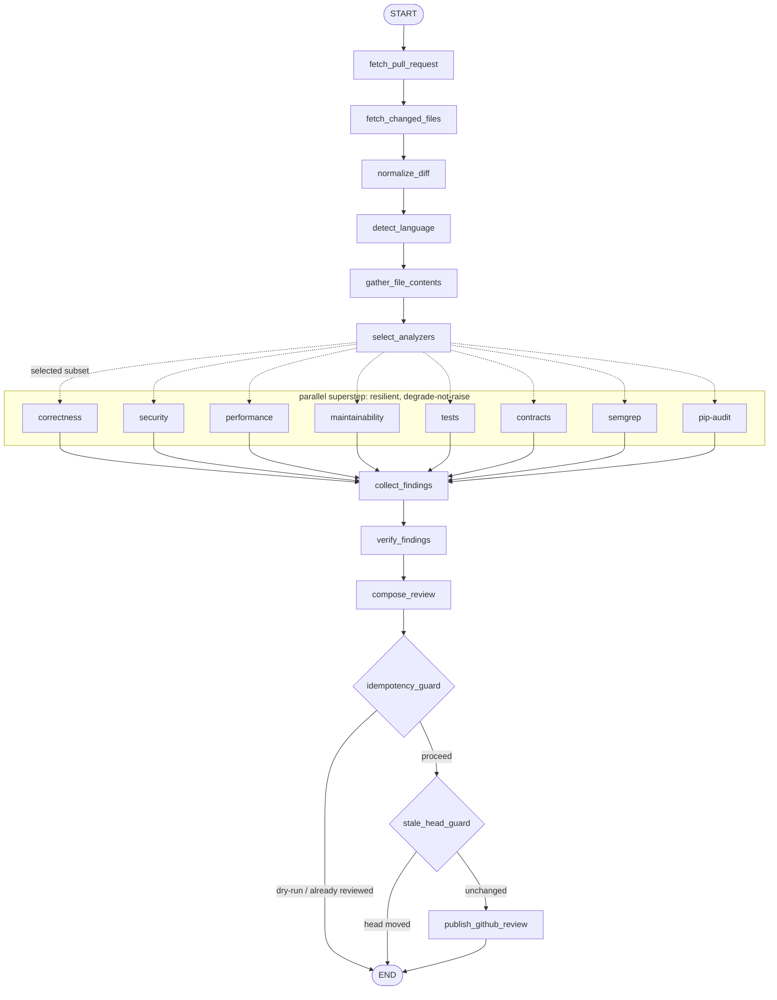
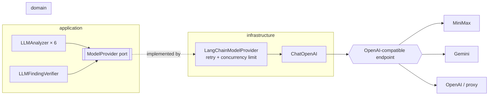
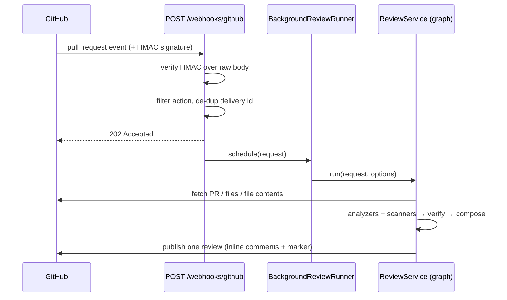
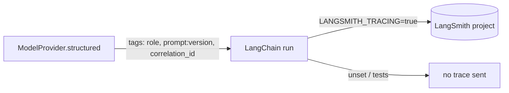

# Diagrams

Mermaid diagrams of how Bicho is put together. They render natively on GitHub. See also the two
diagrams in [ARCHITECTURE.md](../ARCHITECTURE.md) (layers and the high-level pipeline).

## The LangGraph review workflow

A linear spine into one parallel fan-out superstep (analyzers + scanners), fanned back in via
`operator.add` reducers, then a gated publish tail. Every fan-out node degrades to a diagnostic
instead of raising, so one failure never rolls the superstep back.

## The model-provider abstraction

The domain never imports a model vendor. Every LLM call goes through the `ModelProvider` port; the one
infrastructure implementation wraps a LangChain `ChatOpenAI` pointed at any OpenAI-compatible endpoint,
with retry and a concurrency limit. Adding a provider (Gemini, OpenAI, a local proxy) is configuration.

## Webhook to published review

The webhook is acknowledged in milliseconds; the heavy work runs off-request as an isolated background
task. Nothing durable — a restart drops in-flight work, recovered by the manual endpoint.

## LangSmith tracing

When `LANGSMITH_TRACING` is set, LangChain sends each run to LangSmith automatically. Every model call
is tagged with its role, prompt version, and correlation id, so a review's calls are grouped and
inspectable. Tracing is force-off in tests.

